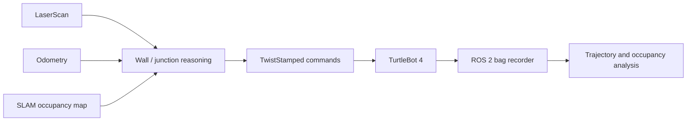

# TurtleBot 4 Autonomous Maze Navigation

A ROS 2 robotics project for mapping, teleoperation, repeatable command playback, autonomous maze exploration, and trajectory analysis on a Clearpath TurtleBot 4.

I built this for the University of Maryland's ENAE450 final competition. The repository is now curated around the source code and representative analysis outputs; generated ROS workspaces, raw bag recordings, and course-distributed materials have been removed.

## System overview



The package contains several approaches and supporting tools:

- `maze_solver.py` — junction-aware depth-first exploration using map, odometry, and lidar inputs
- `right_hand_solver.py` — reactive right-wall-following baseline
- `bag_cmd_vel_player.py` — lidar-assisted start alignment plus command recording/replay
- `teleop.py` — namespaced keyboard control for `TwistStamped`
- `metric_c_bag_recorder.py` and `metric_c_plotter.py` — repeatable run capture, trajectory export, and occupancy-grid reconstruction
- `draw_to_tb4_gazebo_world*.py` — converts a sketched grid into an SDF maze world

Representative trajectory CSVs and plots are retained under `final-comp/metric_c_outputs/old/` as provenance for the analysis workflow. They are historical run artifacts, not benchmark claims.

## Environment

The project targets ROS 2 Jazzy on Ubuntu 24.04 with TurtleBot 4 and Gazebo packages installed. From a ROS workspace:

```bash
mkdir -p ~/tb4_ws/src
cd ~/tb4_ws/src
git clone https://github.com/LucasKazaki/enae450-final-competition.git
cd ..
rosdep install --from-paths src --ignore-src -r -y
colcon build --symlink-install
source install/setup.bash
```

Run the reactive baseline against a namespaced robot:

```bash
ros2 run final-comp right_hand_solver --ros-args \
  -p scan_topic:=/tb4_6/scan \
  -p cmd_topic:=/tb4_6/cmd_vel
```

Record and replay a teleoperated run:

```bash
ros2 run final-comp bag_cmd_vel_player record \
  --bag my_teleop_run --namespace /tb4_6 --center

ros2 run final-comp bag_cmd_vel_player follow \
  --bag my_teleop_run --namespace /tb4_6 --center
```

## Verification

GitHub Actions compiles every Python source file on Python 3.12 to catch syntax regressions. Hardware and simulation validation require a configured ROS 2/TurtleBot environment and are therefore documented as manual integration checks.

## Safety and scope

This is student research software. Test in simulation before operating a physical robot, keep the platform within reach of an emergency stop, and review topic names and speed parameters for your robot. The code is not a certified navigation or safety system.

Copyright © Lucas Tao. No license is granted for reuse or redistribution.
